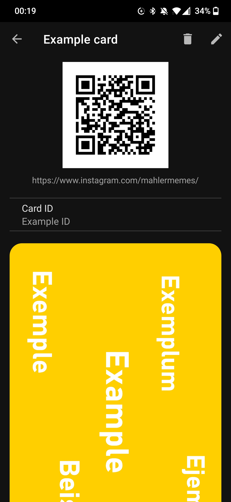
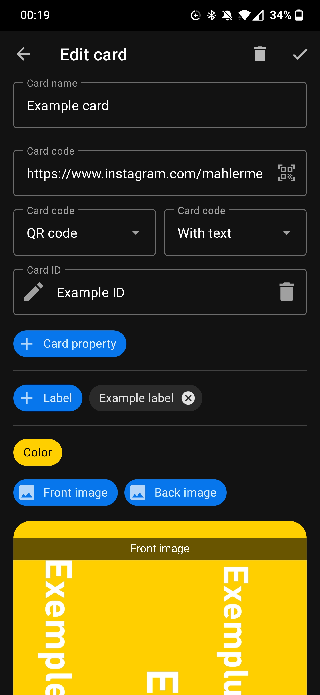
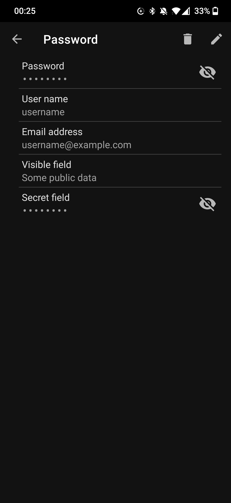
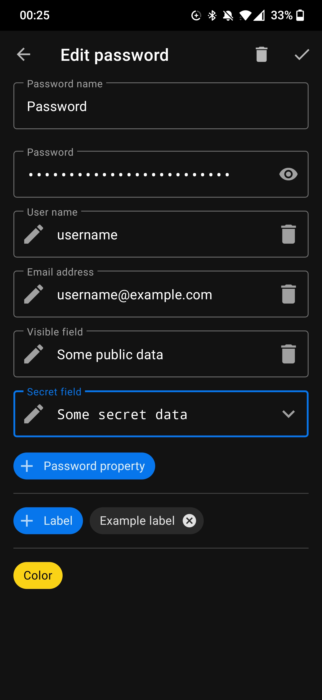
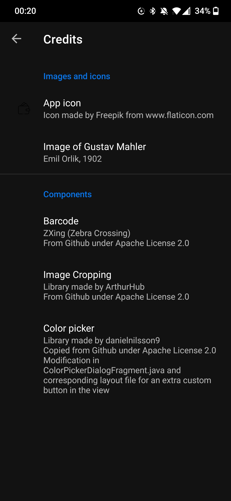

# Wallet
Securely store cards and passwords 

## Features
- Store cards and passwords
- Take photos and scan QR codes
- All data is stored locally and encrypted
- Organize everything with labels
- Dark and light mode (follows the system)
- Languages: English and german (follows the system)

### Important notes
- **Don't rely on this app as the only place to store your passwords**
- You might want to use an app locker for this app

### Screenshots
  |   |   | 
:--------------------------------------------:|:-----------------------------------------------------:|:-------------------------------------------:|:-----------------------------------------:

 |  | 
:-------------------------------------------------:|:--------------------------------------------------:|:-------------------------------------: