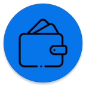
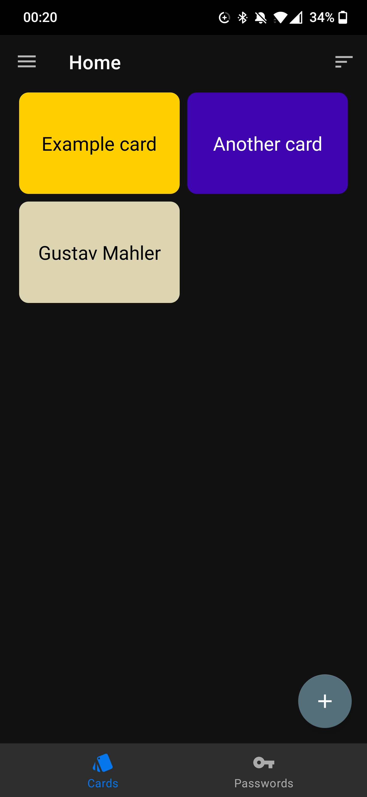
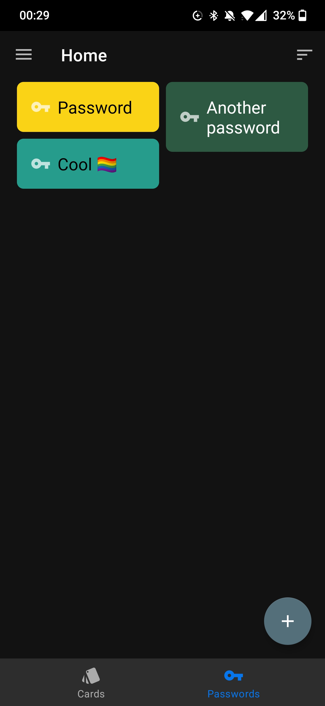

# Wallet
Securely store passwords and cards

## Features
- Store passwords
- Store cards (QR-Code and images, no NFC or similar)
- All data is stored locally and encrypted
- Organize everything with labels
- Dark and light mode (follows the system)
- Languages: English and German (follows the system)

### Important notes
- Set an app password or use fingerprint for the app (see app settings). Alternatively, you could also use an app locker to protect the app.
- **Don't rely on this app as the only place to store your passwords.** If you lose your phone or the app data gets corrupted, your data is lost.
- The app is designed to store your data securely, but no software is perfect. Be aware that there can always be **unknown bugs or security risks**
  See the [license](LICENSE) for detailed information.

### Screenshots
  

### Technical notes
#### App authentication
The app password or fingerprint is not used to encrypt the data. It is just required to open the app.
Argon2id is used to store and verify the app password.

#### Data encryption
All data is encrypted with AES-256-GCM using [encrypted shared preferences](https://developer.android.com/reference/kotlin/androidx/security/crypto/EncryptedSharedPreferences).
Image files are encrypted using AES-256-GCM-HKDF-4KB.
All key material is stored in the [android keystore](https://developer.android.com/privacy-and-security/keystore). 
